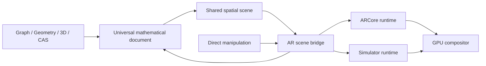
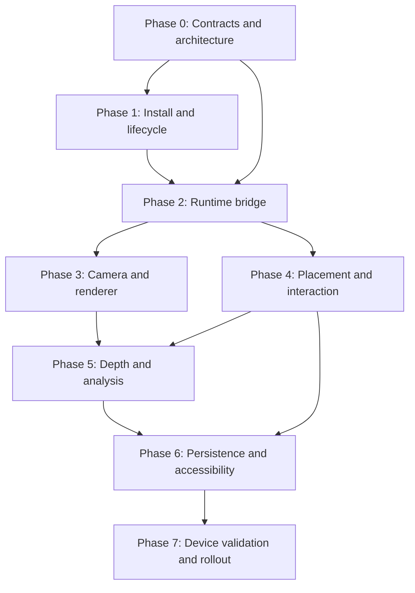

# AI Explorer ARCore Spatial Engine Roadmap

Status: Approved for phased implementation  
Document date: 24 July 2026  
Platform: Android 12+ (`minSdk 31`)  
ARCore SDK baseline: `com.google.ar:core:1.54.0`  
Distribution model: AR Optional

## 1. Objective

Build a production-quality augmented-reality engine that connects AI Explorer's existing Graph, 2D Geometry, 3D Geometry, CAS-derived objects, measurements, lessons, and universal Algebra document to Google ARCore.

AR must remain an interactive representation of the canonical mathematical document. It must not become a separate static-answer system or a second, incompatible geometry engine.

The completed engine must:

- preserve direct manipulation;
- keep Graph, Geometry, 3D, Algebra, CAS, and AR synchronized;
- run safely on ARCore-supported devices;
- retain a complete spatial simulator on unsupported devices;
- provide transparent tracking and measurement uncertainty;
- degrade rendering quality without degrading mathematical correctness;
- remain testable without a physical AR device;
- avoid storing camera imagery unless the user explicitly records a session.

## 2. Current Repository Foundation

The project already contains an initial ARCore integration. Implementation must strengthen and reorganize it rather than create a second stack.

| Area | Existing foundation | Current limitation |
|---|---|---|
| Dependency | ARCore `1.54.0` in the version catalog and app dependency graph | Dependency is present, but release verification and feature gating need formalization |
| Manifest | Camera permission and `com.google.ar.core=optional` metadata | Runtime permission/install states need a typed coordinator |
| Availability | `ARCoreSessionController.checkAvailability()` | Synchronous/transient states and exception handling are incomplete |
| Installation | `ArCoreApk.requestInstall()` | Install-prompt state is not lifecycle-safe |
| Session | Session creation, planes, HDR, autofocus, optional Depth | Session lifecycle is coupled directly to UI and renderer code |
| Frames | Camera pose, matrices, plane count, tracking and light intensity | Full pose orientation, failure reasons, depth frames, and HDR components are incomplete |
| Hit testing | Planes and oriented points | Depth/instant-placement policies and stable hit handles need completion |
| Anchors | Native anchor creation and detach | Anchor pose updates, rotation, replacement, and local offsets need completion |
| Rendering | OpenGL ES camera compositor and shared spatial scene renderer | Camera UV transforms, depth occlusion, resource cleanup, and quality policies need production hardening |
| Scene model | Shared solids, surfaces, vectors, annotations, measurements | AR bridge contracts and cross-view identity need formalization |
| Interaction | Tap placement and scene move/rotate/scale | Object/sub-object picking, previews, gizmos, snapping, grouped edits, and reliable undo are incomplete |
| Persistence | Mathematical scene and spatial placement records | Native anchors cannot be persisted; relocalization workflow needs implementation |
| Fallback | Spatial simulator | Must be promoted to a first-class runtime implementation using the same bridge |

Primary existing files:

- `gradle/libs.versions.toml`
- `app/build.gradle.kts`
- `app/src/main/AndroidManifest.xml`
- `app/src/main/java/com/indianservers/aiexplorer/spatial/ARCoreSessionController.kt`
- `app/src/main/java/com/indianservers/aiexplorer/spatial/ARCoreCompositorView.kt`
- `app/src/main/java/com/indianservers/aiexplorer/spatial/SpatialModels.kt`
- `app/src/main/java/com/indianservers/aiexplorer/spatial/SpatialProduction.kt`
- `app/src/main/java/com/indianservers/aiexplorer/spatial/SpatialRenderer.kt`
- `app/src/main/java/com/indianservers/aiexplorer/spatial/SpatialAuthoring.kt`
- `app/src/main/java/com/indianservers/aiexplorer/core/SpatialInteractionTools.kt`
- `app/src/main/java/com/indianservers/aiexplorer/core/SpatialProductionInteractions.kt`

## 3. Product and Architectural Decisions

### 3.1 AR remains optional

AI Explorer has valuable non-AR Graph, Geometry, CAS, Algebra, and 3D functionality. The Android application will therefore remain **AR Optional**.

Consequences:

- unsupported devices can install and use AI Explorer;
- camera permission is requested only when live AR is explicitly activated;
- Google Play Services for AR is installed or updated through the official ARCore runtime flow;
- the simulator remains available after install refusal, permission denial, or runtime failure;
- Depth cannot be required at Play Store filtering level.

### 3.2 One canonical mathematical document

The universal mathematical document owns object identity, definitions, dependencies, style, selection, measurements, and history. ARCore owns only environmental tracking data.



### 3.3 No Google types in domain models

`Session`, `Frame`, `Pose`, `Anchor`, `Plane`, `HitResult`, and other `com.google.ar.core` types must remain inside the ARCore adapter package. The rest of the application consumes AI Explorer-owned immutable contracts.

### 3.4 Anchor pose and editable pose are separate

Each placed mathematical scene has:

1. a native tracking-anchor pose supplied by ARCore;
2. an editable local scene transform supplied by the user;
3. a mathematical-units-to-metres scale.

Moving, rotating, or scaling a mathematical object must not mutate or destabilize its native tracking anchor.

### 3.5 Mathematical and physical accuracy remain distinct

- Mathematical distances, areas, angles, and volumes can be exact.
- Camera-derived physical measurements are estimates.
- Every physical estimate carries units, tracking state, confidence, and uncertainty.
- AR measurements must never be described as certified measurements.

## 4. Target Module Structure

The exact package split may be adjusted during implementation, but responsibilities must remain separated.

```text
spatial/
  contract/
    ArRuntime.kt
    ArRuntimeState.kt
    ArFrameSnapshot.kt
    ArTrackables.kt
    ArAnchorHandle.kt
    ArDepthSnapshot.kt
  arcore/
    ArCoreRuntime.kt
    ArCoreInstallCoordinator.kt
    ArCoreSessionLifecycle.kt
    ArCoreFrameMapper.kt
    ArCoreAnchorRegistry.kt
    ArCoreExceptionMapper.kt
  simulator/
    SimulatedArRuntime.kt
    SimulatedEnvironment.kt
  bridge/
    SpatialArEngine.kt
    SpatialSceneBridge.kt
    SpatialPlacementCoordinator.kt
    SpatialSelectionBridge.kt
    SpatialMeasurementCoordinator.kt
  rendering/
    ArCameraCompositor.kt
    ArDepthOcclusionRenderer.kt
    SpatialGpuRenderer.kt
    SpatialRenderQualityController.kt
  persistence/
    SpatialPlacementPersistence.kt
    SpatialRelocalizationCoordinator.kt
  testing/
    FakeArRuntime.kt
    ArDatasetTestDriver.kt
```

## 5. Phase Dependency Graph



## 6. Phase 0 — Contracts, Coordinate System, and Safety Baseline

### Goal

Create stable, renderer-neutral AR contracts before changing runtime behavior.

### Deliverables

- Introduce `ArRuntime` with lifecycle, frame, hit-test, anchor, and capability operations.
- Introduce a sealed `ArRuntimeState` state machine.
- Define immutable frame snapshots for:
  - camera pose;
  - view and projection matrices;
  - tracking quality and failure reason;
  - planes and feature points;
  - lighting;
  - depth availability;
  - display-geometry changes.
- Define stable hit-test handles that expire explicitly.
- Define anchor handles without native ARCore references.
- Document coordinate conventions:
  - right-handed coordinate system;
  - metres in the environmental world;
  - mathematical units inside scene-local space;
  - quaternion ordering;
  - matrix ordering;
  - Euler display conversion order.
- Define privacy and physical-safety policies.
- Add an AR feature flag and debug diagnostics surface.
- Add `FakeArRuntime` for deterministic JVM tests.

### Acceptance gate

- No ARCore class appears in shared mathematical, workspace, Graph, Geometry, CAS, or renderer-neutral contracts.
- Pose and coordinate round-trip tests cover translation, rotation, and scale.
- Fake frames can drive placement, tracking loss, anchor updates, and recovery.
- Existing non-AR unit tests remain green.

## 7. Phase 1 — Availability, Download/Install, Permission, and Lifecycle

### Goal

Make entry into and exit from live AR reliable on every device state.

### Runtime state model

```text
Checking
  -> Unsupported
  -> InstallRequired -> InstallRequested -> Checking
  -> UpdateRequired  -> InstallRequested -> Checking
  -> PermissionRequired
  -> CreatingSession -> Ready -> Running -> Paused
  -> RecoverableError
  -> FatalError
```

### Deliverables

- Use early asynchronous availability checking.
- Use `ArCoreApk.requestInstall()` only after an explicit user action.
- Track whether the installation prompt has already been requested during the current attempt.
- Handle installation cancellation without prompt loops.
- Handle update-required and device-profile download states.
- Request camera permission only for live AR.
- Provide permission rationale and settings recovery.
- Map ARCore exceptions to actionable application states.
- Coordinate Activity, Compose, `GLSurfaceView`, and ARCore session lifecycle.
- Pause the renderer before pausing the ARCore session.
- Resume the ARCore session before resuming frame rendering.
- Close native sessions and anchors deterministically.
- Retain the simulator through every failure state.
- Add the required Google Play Services for AR privacy disclosure.

### Required failure scenarios

- unsupported device;
- Google Play Services for AR absent;
- Google Play Services for AR outdated;
- user declines installation;
- user denies camera permission;
- user selects “do not ask again”;
- camera is in use by another application;
- app backgrounds during installation;
- app backgrounds during tracking;
- session creation throws an availability exception;
- camera becomes unavailable during resume.

### Acceptance gate

- No crash or install loop in any required failure scenario.
- Installation is prompted at most once per explicit activation attempt.
- Permission denial never disables the simulator.
- Repeated live-AR entry/exit does not leak native session resources.

## 8. Phase 2 — AR Runtime and Existing-Engine Bridge

### Goal

Connect ARCore environmental state to the existing mathematical scene without duplicating the mathematical engines.

### Deliverables

- Implement `ArCoreRuntime` behind `ArRuntime`.
- Implement `SimulatedArRuntime` behind the same interface.
- Map complete ARCore poses, including quaternion rotation.
- Map tracking failure reasons into user guidance.
- Map planes, oriented feature points, and supported depth hits.
- Maintain an anchor registry with explicit detach and replacement.
- Update anchor poses and tracking states each frame.
- Build `SpatialSceneBridge` from universal object identity to `SpatialRenderScene` primitives.
- Connect:
  - 2D points, lines, circles, conics, polygons, and measurements;
  - 3D points, vectors, lines, planes, surfaces, meshes, and solids;
  - explicit, implicit, polar, and parametric graph representations where spatially meaningful;
  - CAS-derived curves, surfaces, solutions, and parameters;
  - universal Algebra selection, visibility, styling, and deletion.
- Preserve one canonical ID across Algebra, Graph, Geometry, 3D, and AR representations.
- Add cross-view selection and dependency highlighting.

### Acceptance gate

- The simulator and ARCore render the same canonical scene.
- Editing an Algebra definition updates its AR representation.
- Dragging a permitted AR handle updates the canonical document and every linked view.
- Deleting an object detaches associated anchors and overlays.
- Fake-runtime tests cover all frame and anchor state transitions.

## 9. Phase 3 — Production Camera Compositor and GPU Renderer

### Goal

Render the camera and mathematical scene correctly across rotations, aspect ratios, and performance tiers.

### Deliverables

- Replace hard-coded display rotation with the actual Android display rotation.
- Transform camera texture coordinates through ARCore when display geometry changes.
- Correct camera crop, rotation, mirroring, and aspect handling.
- Validate shader compilation and program linking with useful diagnostics.
- Release all textures, buffers, shaders, programs, and renderer resources.
- Support full anchor rotation in the model matrix.
- Implement environment HDR inputs:
  - main-light direction;
  - main-light intensity;
  - spherical harmonics;
  - exposure normalization.
- Add frustum culling and incremental buffer updates.
- Avoid recompiling unchanged mathematical meshes every frame.
- Connect thermal and frame-time observations to renderer quality.
- Provide Ultra, High, Balanced, Low, and Safety quality tiers.
- Preserve outlines and labels when expensive effects are disabled.

### Acceptance gate

- Camera background remains correct in portrait, landscape, split screen, and foldable posture changes.
- Anchored objects remain stable under camera motion and device rotation.
- GL resources return to baseline after repeated AR entry/exit.
- Quality-tier changes do not change mathematical values or object identity.

## 10. Phase 4 — Placement, Picking, and Direct Manipulation

### Goal

Make AR a direct-manipulation mathematical workspace rather than a passive viewer.

### Deliverables

- Plane and feature-point visualization.
- Placement reticle with tracking, surface type, confidence, and estimated scale.
- Ghost scene preview before anchor creation.
- Ranked hit-test policy:
  1. valid plane polygon;
  2. depth hit;
  3. oriented feature point;
  4. instant-placement estimate;
  5. simulator fallback.
- Support horizontal and vertical placement.
- Separate native anchor pose from editable local transform.
- Whole-object and sub-object picking.
- Selection cycling for overlapping objects.
- Occluded-object selection and isolate/hide controls.
- Translation arrows, rotation rings, and scale handles.
- Numeric position, rotation, scale, plane, and vector editors.
- Constraint-aware snapping to axes, planes, points, vertices, edges, and faces.
- Multi-selection, groups, alignment, distribution, and shared transforms.
- Delete, duplicate, copy, paste, hide, lock, and layer operations.
- One continuous gesture produces one undoable semantic command.
- Tracking-loss recovery without destroying mathematical state.
- Stylus hover preview and precision mode.

### Acceptance gate

- Preview and committed placement agree within the displayed uncertainty.
- Direct manipulation updates linked views in the same interaction frame where practical.
- Native anchors remain stable while local objects are transformed.
- Undo/redo restores document, selection, grouping, and local placement state.
- Delete removes the selected object and releases related native resources.

## 11. Phase 5 — Depth, Occlusion, Surface Analysis, and Measurement

### Goal

Use environmental depth and mathematical analysis to create spatially credible, educational interactions.

### Deliverables

- Acquire Depth images only on supported devices and only when enabled.
- Upload depth data to a GPU texture with correct coordinate transforms.
- Implement depth-based fragment occlusion.
- Add an outline/ghost fallback when depth is unavailable.
- Use depth to improve placement and interaction hits.
- Add constrained on-surface trace points.
- Add normals, tangent planes, and gradient arrows at selected points.
- Add editable cross-section planes with draggable handles.
- Add contour-level handles and projected contour inspection.
- Add gradient ascent/descent playback and editable paths.
- Add measurement handles for distance, angle, area, volume, and section perimeter.
- Propagate pose, depth, and endpoint uncertainty into physical measurements.
- Clearly distinguish exact mathematical measurements from environmental estimates.

### Acceptance gate

- Supported devices correctly occlude virtual geometry behind real geometry.
- Unsupported devices retain all mathematical analysis with a documented visual fallback.
- Every physical measurement displays units and uncertainty.
- Depth acquisition does not leak image handles or stall the frame loop.

## 12. Phase 6 — Persistence, Relocalization, Replay, Privacy, and Accessibility

### Goal

Make spatial work recoverable, testable, private, and accessible.

### Deliverables

- Persist the canonical mathematical scene and local placement transform.
- Never persist native `Anchor`, `Frame`, `HitResult`, or session objects.
- Treat persisted anchor identifiers as hints, not guaranteed native handles.
- Implement explicit relocalization and re-placement workflows.
- Preserve lessons, measurements, selection, styling, scale mode, and uncertainty metadata.
- Add ARCore Recording and Playback support for controlled test datasets.
- Require explicit user action and visible status for recording.
- Do not store camera imagery during ordinary AR use.
- Document data-retention and deletion behavior.
- Add screen-reader scene hierarchy and selected-object descriptions.
- Provide accessible descriptions of position, orientation, dependencies, and measurements.
- Provide seated/small-space mode and movement-safety guidance.
- Export selected meshes, contours, measurements, and mathematical definitions.

### Acceptance gate

- Saved work never depends on a dead native session object.
- Reload either relocalizes safely or asks the user to re-place the scene.
- Recording cannot begin implicitly.
- Critical AR actions are possible without gesture-only interaction.

## 13. Phase 7 — Device Validation, Performance Gates, and Rollout

### Automated verification

- AR state-machine tests;
- coordinate and quaternion property tests;
- typed hit-ranking tests;
- anchor replacement and detach tests;
- fake-frame tracking-loss tests;
- shader and renderer error tests;
- persistence migration tests;
- ARCore recording/playback regression datasets;
- Graph, Geometry, 3D, Algebra, CAS, and workspace regression suites;
- accessibility semantics tests;
- macrobenchmark tests for startup, frame time, memory, and thermal degradation.

### Physical device matrix

| Device class | Required coverage |
|---|---|
| ARCore phone without Depth | install, placement, tracking, fallback visuals |
| ARCore phone with Depth | occlusion, depth hit testing, uncertainty |
| Large tablet | layout, picking, two-handed interaction |
| Foldable | posture and viewport changes |
| Stylus device | hover, selection, precision mode |
| Low-memory device | resource release and quality degradation |
| Thermally constrained device | sustained session and safety policy |
| Unsupported device | complete simulator and no AR crash |
| Permission-denied device | recovery and settings flow |

### Performance gates

- Baseline supported devices maintain a stable 30 fps target.
- High-tier devices target 60 fps where thermal conditions permit.
- No unbounded native, image, anchor, or GL resource growth.
- Frame-time degradation triggers a lower render tier before interaction becomes unstable.
- Mathematical evaluation never changes precision because rendering quality changes.

### Rollout

1. Internal feature flag.
2. Developer device matrix.
3. Recorded-dataset regression gate.
4. Closed testing track.
5. Small percentage production rollout.
6. Progressive expansion after crash, ANR, thermal, and session-start metrics meet gates.
7. Immediate remote disable path for live AR while retaining the simulator.

## 14. Deferred Advanced AR Capabilities

These are valuable but must not delay the reliable local AR engine:

- Cloud Anchors and shared classroom sessions;
- Geospatial anchors;
- Augmented Images for textbook and worksheet recognition;
- Scene Semantics;
- room-scale lesson orchestration;
- multi-user synchronized constructions;
- persistent cross-device world maps.

Each deferred capability requires its own privacy, network, quota, failure, and consent review.

## 15. Definition of Done for the AR Program

The AR program is complete when:

- ARCore installation and lifecycle are reliable;
- the simulator remains complete on every device;
- one canonical mathematical object drives all linked representations;
- live AR supports placement, selection, transformation, deletion, undo, measurement, and analysis;
- depth and lighting degrade gracefully;
- persistence never relies on native session objects;
- exact mathematics and estimated physical measurements are never confused;
- accessibility and safety paths are first-class;
- automated and physical-device validation gates pass;
- rollout can be disabled without disabling non-AR spatial mathematics.

## 16. Implementation Order

Work proceeds phase by phase. A phase begins only after the previous phase's acceptance gate is satisfied, except where Phase 1 and early Phase 2 contract tests can safely run in parallel after Phase 0.

- [ ] Phase 0 — Contracts, coordinates, safety baseline
- [ ] Phase 1 — Availability, install, permission, lifecycle
- [ ] Phase 2 — Runtime and existing-engine bridge
- [ ] Phase 3 — Camera compositor and GPU renderer
- [ ] Phase 4 — Placement, picking, direct manipulation
- [ ] Phase 5 — Depth, analysis, measurements
- [ ] Phase 6 — Persistence, replay, privacy, accessibility
- [ ] Phase 7 — Device validation and rollout

## 17. Official References

- [Enable AR in an Android app](https://developers.google.com/ar/develop/java/enable-arcore)
- [Configure an ARCore session](https://developers.google.com/ar/develop/java/session-config)
- [Use Depth in an Android app](https://developers.google.com/ar/develop/java/depth/developer-guide)
- [ARCore Recording and Playback](https://developers.google.com/ar/develop/java/recording-and-playback/developer-guide)
- [What is new in ARCore](https://developers.google.com/ar/whatsnew-arcore)
- [ARCore supported devices](https://developers.google.com/ar/devices)
